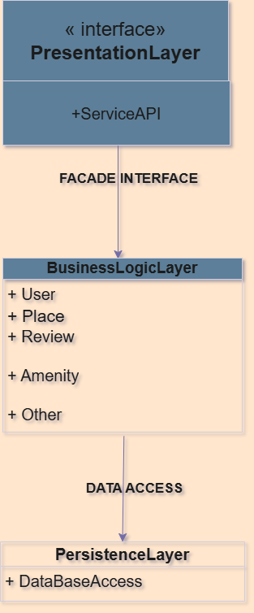
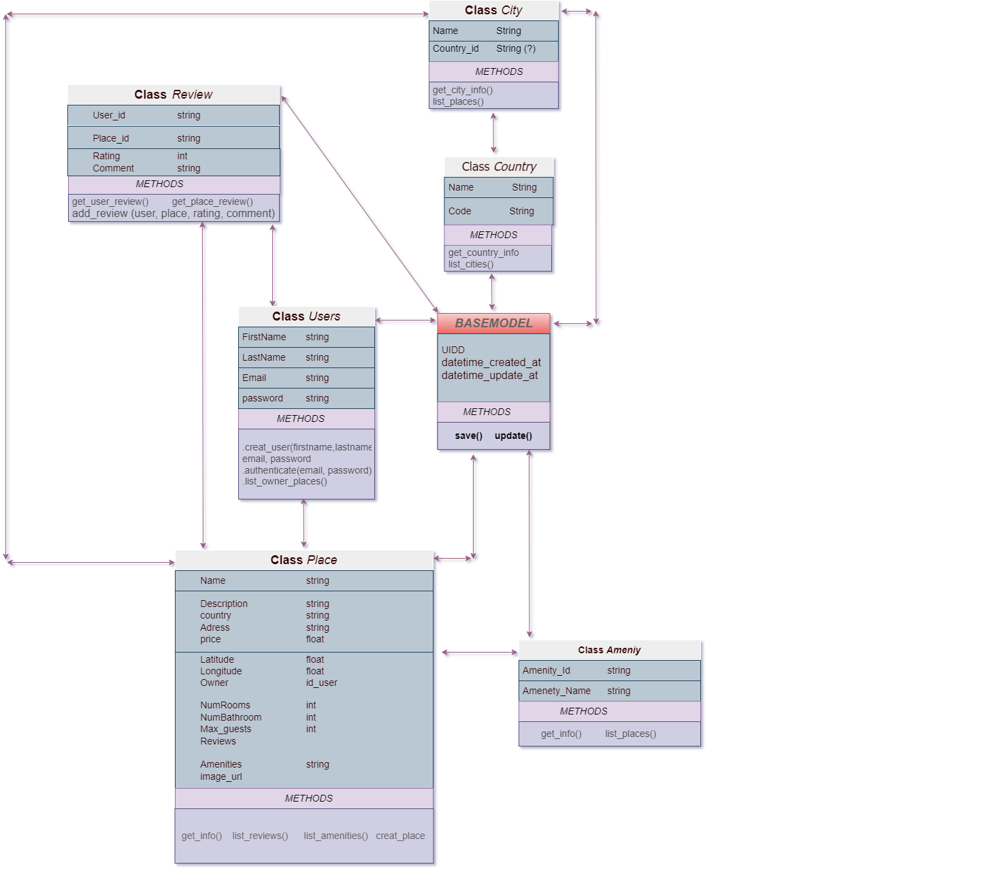
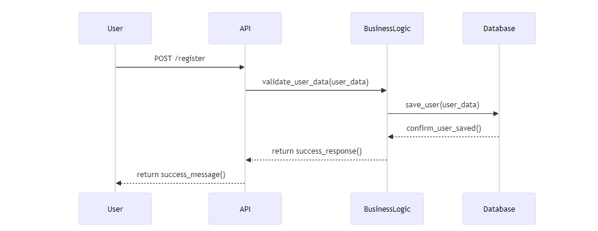
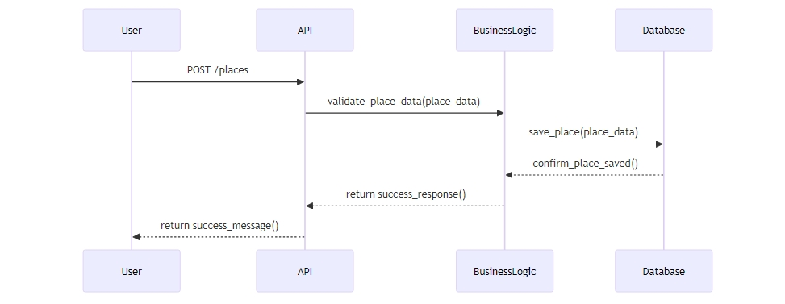
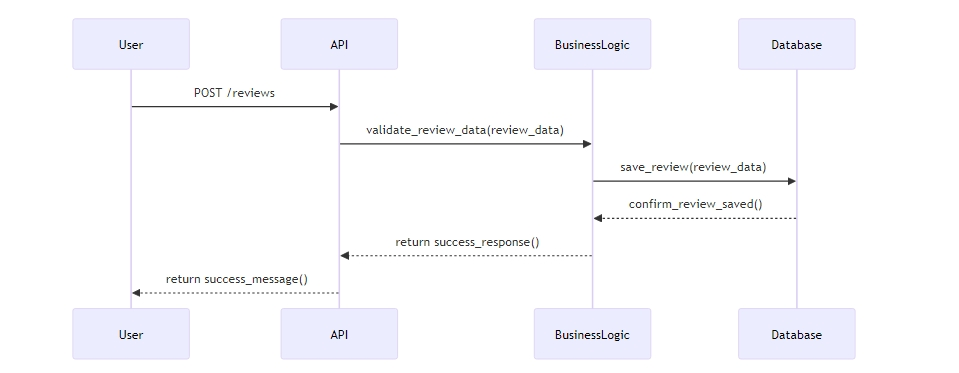
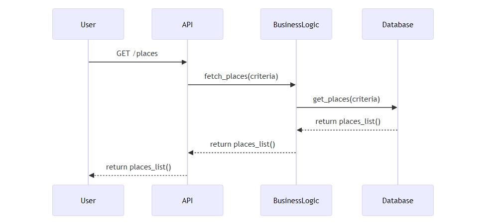

# HBnB Evolution Project

## Overview

The HBnB Evolution project aims to develop a simplified version of an Airbnb-like application. The application enables user management, property listing, review submissions, and amenity management.

## Team Members
- Jeanpaul Dijeont

## Table of Contents

1. [Project Objectives](#project-objectives)
2. [Features](#features)
3. [Architecture](#architecture)
4. [Diagrams](#diagrams)
5. [API Endpoints](#api-endpoints)
6. [Installation](#installation)
7. [Author](#author)

## Project Objectives

- Create technical documentation for the HBnB Evolution application.
- Document the architecture, business logic, and interactions within the system.

## Features

- **User Management**: Register, update, and manage users as regular or admin.
- **Place Management**: List properties with details and manage amenities.
- **Review Management**: Submit and manage reviews for places.
- **Amenity Management**: Create and manage amenities associated with places.

## Architecture

The application follows a layered architecture:

1. **Presentation Layer**: Handles user interactions and API calls.
2. **Business Logic Layer**: Contains the core logic and models.
3. **Persistence Layer**: Manages data storage and retrieval.

### Diagrams

- **High-Level Package Diagram**  


- **Detailed Class Diagram**  


- **Sequence Diagrams**:  
    - User Registration  
    
  
    - Place Creation  
    
  
    - Review Submission  
    
  
    - Fetching Places  
    

## API Endpoints

- **POST /api/users/register**: Register a user.
- **POST /api/places**: Create a place listing.
- **POST /api/reviews**: Submit a review.
- **GET /api/places**: Fetch a list of places based on specified criteria.

## Installation

1. Clone the repository:
   ```bash
   git clone https://github.com/Weebaay/holbertonschool-higher_level_programming.git


## Author

This project was completed as part of the Holberton School curriculum by **Jean-Paul Dijeont**.
